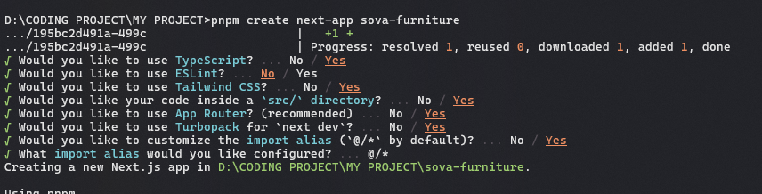

# This is a [Next.js](https://nextjs.org) project with [`create-next-app`](https://nextjs.org/docs/app/api-reference/cli/create-next-app).

## DOCUMENTATION

### Installation

- First you installed pnpm, as we know pnpm is more light than npm create app
    ```bash
    npm install -g pnpm
    ```
- Then create app use <b>pnpm</b>
    ```bash
    pnpm create next-app
    ```
- Configure as shown below
    
- Enter the directory
  ```bash
    cd <Your-Project-Name>
  ```
- Test or Run your App by this command
  ```bash
    pnpm dev
  ```

### TailwindCSS Installation & Configure 
- Install TailwindCSS
  ```bash
    pnpm install -D tailwindcss @tailwindcss/postcss postcss
  ```
  notes:
  - -D is installing as devDependencies (just needed when development, not production)
  - @tailwindcss/postcss is a plugin add-on, usually for optimation in tailwind
  - postcss is Tool to process CSS with plugin
  - after I installed it, it turned out to be installed by default
- Configure Font Family
  [NextJS Font Optimizing](https://nextjs.org/docs/pages/building-your-application/optimizing/fonts)
  - ```layouts.tsx```
  ```javascript
      import { Inter } from 'next/font/google'
      
      // If loading a variable font, you don't need to specify the font weight
      const inter = Inter({ subsets: ['latin'] })
      
      export default function MyApp({ Component, pageProps }) {
        return (
          <main className={inter.className}>
            <Component {...pageProps} />
          </main>
        )
      }
  ```

- Configure ```postcss.config.mjs```
  ```mjs
        /** @type {import('tailwindcss').Config} */

    const config = {
      plugins: {
        "@tailwindcss/postcss": {}
      },
      content: [
        "./src/app/**/*.{js,ts,jsx,tsx}", // Untuk App Router (Next.js 13+)
        "./src/pages/**/*.{js,ts,jsx,tsx}", // Untuk Page Router
        "./src/components/**/*.{js,ts,jsx,tsx}", // Untuk komponen
      ],
    };

    export default config;

  ```


### NextJS Favicon
- Create favicon.ico in app folder
This documentation is still under development, so developers are still looking for a solution on how to customize favicons.


### NextJS Route API
- NextJS is a file-based routing architecture. means you must create folder to make some API routes
- Example: http://localhost:3000/api/user/3 i want this to return json
- Create folder ```api``` in ```/src/app/``` folder
- In folder ```api```, create folder ```user```, then create folder ```[id]```
- Result folder is ```src/app/api/user/[id]/route.ts``` (route.ts is default name to create API Logic)
- Create logic route in ```route.ts``` file


## NOTE
